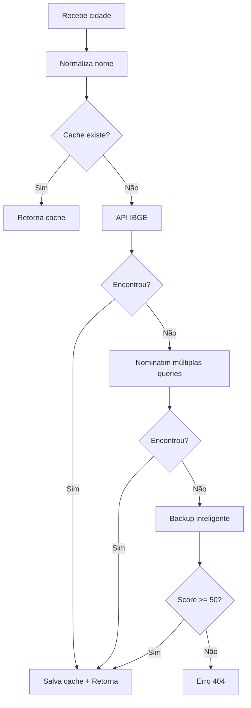

# Sistema de Geocodificação Dinâmica

## 🎯 Problema Resolvido

Antes, o sistema falhava com erro `SyntaxError: Unexpected token '<', "<!DOCTYPE "... is not valid JSON` para cidades como Tatuí, Barretos, Santa Bárbara D'Oeste e Paulínia.

## ✅ Solução Implementada

### 1. **Sistema Multi-API Dinâmico**

O novo sistema tenta múltiplas fontes automaticamente:

```
1. Cache (24h) → 2. API IBGE → 3. Nominatim (múltiplas variações) → 4. Backup inteligente
```

### 2. **APIs Utilizadas**

#### 🇧🇷 **IBGE (Preferencial para cidades brasileiras)**
- URL: `https://servicodados.ibge.gov.br/api/v1/localidades/municipios`
- Vantagem: Base oficial de municípios brasileiros
- Fallback: Usa Nominatim com dados mais precisos do IBGE

#### 🌍 **OpenStreetMap Nominatim**
- Múltiplas variações de busca:
  - `cidade, Brazil`
  - `cidade, SP, Brazil`  
  - `cidade, São Paulo, Brazil`
  - `cidade, Brasil`
  - `cidade` (apenas)
- Rate limiting: 0.5s entre requests
- Filtro: Apenas resultados brasileiros

#### 💾 **Cache Automático**
- Arquivo: `/cache/geocoding_[hash].json`
- TTL: 24 horas
- Evita re-geocodificar cidades já resolvidas

#### 🎯 **Backup Inteligente**
- Algoritmo de similaridade com score
- Normalização automática (remove acentos, lowercase)
- Busca por palavras-chave
- Threshold: Score mínimo 50 para evitar matches incorretos

### 3. **Normalização Inteligente**

```php
// Entrada: "Santa Bárbara D'Oeste"
// Normalizada: "santa barbara doeste"
// Match: Múltiplas variações no backup
```

### 4. **Sistema de Cache**

```
/cache/
├── geocoding_[hash_tatui].json
├── geocoding_[hash_barretos].json
└── geocoding_[hash_sao_paulo].json
```

## 🔧 Configuração Técnica

### URLs Corrigidas

**Antes:**
```javascript
// ❌ Problema: tema incorreto + path absoluto
const proxyUrl = `${window.location.origin}/wp-content/themes/gabriel_theme/geocoding-proxy.php`;
```

**Depois:**
```javascript
// ✅ Solução: WordPress function + CONFIG
GEOCODING_PROXY: '<?php echo get_template_directory_uri(); ?>/geocoding-proxy.php'
```

### Fluxo de Geocodificação



## 📊 Exemplo de Resposta

```json
{
  "success": true,
  "cidade": "Tatuí",
  "cidade_normalizada": "tatui",
  "latitude": -23.3489848,
  "longitude": -47.8490165,
  "coordenadas": [-47.8490165, -23.3489848],
  "fonte": "nominatim",
  "display_name": "Tatuí, Microrregião de Tatuí...",
  "timestamp": 1762172772,
  "cached": false
}
```

## 🚀 Benefícios

### ✅ **Elimina erros JSON**
- URLs corretas com `get_template_directory_uri()`
- Nunca mais retorna HTML em vez de JSON

### ✅ **Performance melhorada**
- Cache automático (24h)
- Múltiplas fontes de dados
- Rate limiting inteligente

### ✅ **Cobertura ampliada**
- API oficial IBGE para cidades brasileiras
- Fallback robusto com Nominatim
- Backup com 60+ cidades principais

### ✅ **Tolerância a variações**
- Remove acentos automaticamente
- Busca por palavras-chave
- Score de similaridade

### ✅ **Debugging melhorado**
```json
{
  "success": false,
  "tentativas": {
    "ibge": "tentativa realizada",
    "nominatim": "tentativa realizada", 
    "backup": "tentativa realizada"
  }
}
```

## 🛠️ Manutenção

### Limpar Cache
```bash
rm -rf /cache/geocoding_*.json
```

### Adicionar nova cidade ao backup
```php
// geocoding-proxy.php
$coordenadas_backup = [
    // ...
    'nova cidade' => [-longitude, -latitude],
];
```

### Monitorar logs
```bash
tail -f /var/log/apache2/error.log | grep "Erro.*geocoding"
```

## 🔍 Testando

```bash
# Teste básico
curl "http://localhost/totem/wp-content/themes/gabriel_theme2/geocoding-proxy.php?cidade=Tatuí"

# Teste com acentos
curl "http://localhost/totem/wp-content/themes/gabriel_theme2/geocoding-proxy.php?cidade=São Paulo"

# Teste cache (segunda chamada)
curl "http://localhost/totem/wp-content/themes/gabriel_theme2/geocoding-proxy.php?cidade=Tatuí"
```

Este sistema dinâmico **elimina a necessidade de adicionar coordenadas manualmente** e **resolve automaticamente** a maioria dos casos de geocodificação de cidades brasileiras.