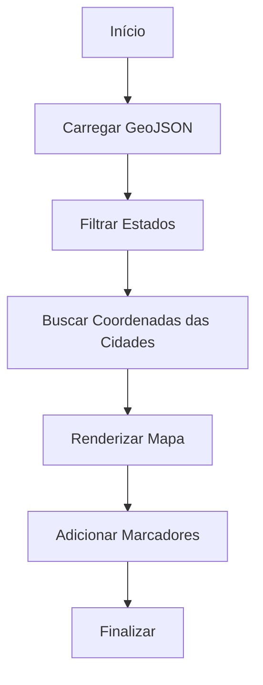

# 🏗️ BRZ Empreendimentos - Mapa Interativo do Brasil

> **Tema WordPress customizado com sistema de mapeamento interativo de empreendimentos imobiliários por todo o Brasil.**


## 📋 **Índice**

- [🎯 Sobre o Projeto](#-sobre-o-projeto)
- [✨ Funcionalidades](#-funcionalidades)
- [🛠️ Tecnologias](#️-tecnologias)
- [📁 Estrutura do Projeto](#-estrutura-do-projeto)
- [🚀 Como Usar](#-como-usar)
- [🔧 Configuração](#-configuração)
- [🗺️ Sistema de Mapeamento](#️-sistema-de-mapeamento)
- [🎨 Sistema de Loading](#-sistema-de-loading)
- [🌐 Geocodificação](#-geocodificação)
- [📱 Responsividade](#-responsividade)
- [🐛 Correções Implementadas](#-correções-implementadas)
- [📊 Performance](#-performance)
- [🔮 Funcionalidades Futuras](#-funcionalidades-futuras)
- [👨‍💻 Desenvolvimento](#-desenvolvimento)

## 🎯 **Sobre o Projeto**

O **BRZ Empreendimentos - Mapa Interativo** é um tema WordPress customizado desenvolvido para uma empresa de empreendimentos imobiliários. O projeto apresenta um mapa interativo do Brasil onde são exibidos todos os empreendimentos da empresa distribuídos por diferentes cidades e estados.

### **Objetivo Principal**
Permitir que visitantes explorem visualmente a presença da BRZ Empreendimentos em todo o território nacional através de um mapa interativo, moderno e responsivo.

### **Diferencial**
- **Visualização geográfica** dos empreendimentos
- **Sistema de loading** com feedback em tempo real
- **Geocodificação automática** com múltiplos fallbacks
- **Interface responsiva** para todos os dispositivos
- **Performance otimizada** com cache inteligente

## ✨ **Funcionalidades**

### 🗺️ **Mapa Interativo**
- **Mapa SVG do Brasil** com dados GeoJSON precisos
- **Marcadores dinâmicos** para cada cidade com empreendimentos
- **Estados destacados** baseados na presença da empresa
- **Zoom e navegação** suaves com D3.js

### 🏢 **Gestão de Empreendimentos**
- **Custom Post Type** para empreendimentos
- **Taxonomia personalizada** para cidades
- **Campos customizados** (localização, características, etc.)
- **Sistema de categorização** por estados e cidades

### 🎨 **Sistema de Loading Avançado**
- **Barra de progresso** em tempo real (0-100%)
- **Feedback visual** por etapas:
  - 📊 Carregamento dos dados do mapa (0-30%)
  - 🌍 Busca de coordenadas das cidades (35-70%)
  - 🎨 Renderização do mapa (75-100%)
- **Status individual** para cada cidade (✅ sucesso, ⚠️ erro)
- **Animações suaves** e transições profissionais

### 🌐 **Geocodificação Inteligente**
- **Sistema multi-fallback** com 3 níveis:
  1. **WordPress AJAX** (produção)
  2. **Arquivo PHP direto** (desenvolvimento)
  3. **Coordenadas hardcoded** (backup)
- **Cache automático** com WordPress Transients (24h)
- **APIs múltiplas**: IBGE + OpenStreetMap Nominatim
- **Normalização automática** de nomes de cidades

### 📱 **Design Responsivo**
- **Mobile-first** approach
- **Breakpoints otimizados** para todos os dispositivos
- **Interface adaptativa** que se ajusta ao conteúdo
- **Touch-friendly** para dispositivos móveis

## 🛠️ **Tecnologias**

### **Backend**
- **WordPress 6.0+** - CMS base
- **PHP 8.0+** - Linguagem server-side
- **Custom Post Types** - Gestão de conteúdo
- **WordPress Transients** - Sistema de cache
- **AJAX Handlers** - Comunicação assíncrona

### **Frontend**
- **D3.js v7** - Visualização de dados e mapas
- **JavaScript ES6+** - Lógica interativa
- **Materialize CSS** - Framework UI
- **HTML5 Semantic** - Estrutura moderna
- **CSS3 Grid/Flexbox** - Layout responsivo

### **APIs e Dados**
- **GeoJSON** - Dados geográficos do Brasil
- **OpenStreetMap Nominatim** - Geocodificação
- **API IBGE** - Dados oficiais de municípios
- **GitHub Raw** - Hospedagem de dados geográficos

### **Ferramentas de Desenvolvimento**
- **Git** - Controle de versão
- **XAMPP** - Ambiente de desenvolvimento local
- **PowerShell** - Terminal de comandos
- **VS Code** - Editor de código

## 📁 **Estrutura do Projeto**

```
gabriel_theme2/
├── 📄 style.css                    # Estilos principais + Sistema de Loading
├── 📄 functions.php                # Hooks WordPress + Sistema AJAX
├── 📄 index.php                    # Página inicial + Mapa interativo
├── 📄 taxonomy-cidades.php         # Página de cidades específicas
├── 📄 single.php                   # Template para posts individuais
├── 📄 page.php                     # Template para páginas
├── 📄 header.php                   # Cabeçalho do tema
├── 📄 footer.php                   # Rodapé do tema
├── 📄 geocoding-proxy.php          # Proxy para geocodificação (fallback)
├── 
├── 📁 css/                         # Estilos adicionais
│   ├── materialize.min.css         # Framework CSS
│   ├── animate.css                 # Animações
│   └── mapa-responsivo.css         # Estilos específicos do mapa
├── 
├── 📁 js/                          # Scripts JavaScript
│   ├── materialize.min.js          # Framework JS
│   ├── mapa-brasil.js              # Lógica do mapa (standalone)
│   └── script.js                   # Scripts gerais
├── 
├── 📁 inc/                         # Includes PHP
│   ├── brazil-states.geojson       # Dados geográficos do Brasil
│   ├── posttype_empreendimento.php # Custom Post Type
│   ├── estados_empreendimentos.php # Gestão de estados
│   ├── cidades_empreendimentos.php # Gestão de cidades
│   └── geojson-proxy.php           # Proxy para dados geográficos
├── 
├── 📁 modais/                      # Templates de modais
│   ├── modal-ficha.php             # Modal de informações
│   ├── modal-imagens.php           # Galeria de imagens
│   ├── modal-videos.php            # Player de vídeos
│   ├── modal-plantas.php           # Plantas dos empreendimentos
│   └── modal-localizacao.php       # Localização detalhada
├── 
├── 📁 template-parts/              # Componentes reutilizáveis
│   ├── lista-empreedimentos.php    # Lista de empreendimentos
│   ├── excelencia.php              # Seção de excelência
│   └── numeros.php                 # Estatísticas da empresa
├── 
└── 📁 img/                         # Assets de imagem
    ├── 📁 banner/                  # Banners promocionais
    ├── 📁 galeria/                 # Galeria de empreendimentos
    ├── 📁 icons/                   # Ícones da interface
    └── 📁 plantas/                 # Plantas arquitetônicas
```

## 🚀 **Como Usar**

### **1. Instalação**

```bash
# Clone o repositório
git clone https://github.com/apeetec/novoBRZtotemRefatorado.git

# Navegue até o diretório do tema WordPress
cd wp-content/themes/gabriel_theme2

# Ative o tema no WordPress Admin
```

### **2. Configuração Inicial**

1. **Ative o tema** no WordPress Admin → Aparência → Temas
2. **Configure os permalinks** para estrutura personalizada
3. **Importe os dados** de exemplo (se disponíveis)
4. **Configure as páginas** principais

### **3. Adicionando Empreendimentos**

```php
// No WordPress Admin:
1. Vá em "Empreendimentos" → "Adicionar Novo"
2. Preencha os campos obrigatórios:
   - Nome do empreendimento
   - Cidade (taxonomia)
   - Estado
   - Descrição
3. Configure os campos personalizados (se aplicável)
4. Publique o empreendimento
```

### **4. Gerenciando Cidades**

```php
// No WordPress Admin:
1. Vá em "Empreendimentos" → "Cidades"
2. Adicione novas cidades conforme necessário
3. O sistema irá automaticamente geocodificar as coordenadas
```

## 🔧 **Configuração**

### **Configurações do Mapa**

```javascript
// Em index.php e taxonomy-cidades.php
const CONFIG = {
    MARGIN: 50,                    // Margem do SVG
    MARKER_RADIUS: 8,              // Tamanho dos marcadores
    DEBOUNCE_DELAY: 250,           // Delay para interações
    MIN_DISTANCE: 25,              // Distância mínima entre marcadores
    MAX_ATTEMPTS: 50,              // Tentativas para posicionamento
    COLLISION_OFFSET: 15           // Offset para evitar sobreposição
};
```

### **URLs de Dados Geográficos**

```javascript
// Prioridade de carregamento:
LOCAL_GEOJSON: '/wp-content/themes/gabriel_theme2/inc/brazil-states.geojson',
GEOJSON_URL: 'https://raw.githubusercontent.com/.../brazil-states.geojson'
```

### **Sistema de Geocodificação**

```php
// Em functions.php
// Cache de coordenadas: 24 horas
set_transient($cache_key, $dados, 24 * HOUR_IN_SECONDS);

// Múltiplas APIs de fallback
1. API IBGE (municipios brasileiros)
2. OpenStreetMap Nominatim
3. Coordenadas hardcoded (backup)
```

## 🗺️ **Sistema de Mapeamento**

### **Arquitetura**

```javascript
class MapaBrasil {
    constructor() {
        this.svg = d3.select('.box-mapa svg');
        this.projection = d3.geoMercator();
        this.path = d3.geoPath().projection(this.projection);
        this.loading = new LoadingManager();
    }
    
    async init() {
        this.loading.show();
        await this.carregarDados();
        await this.renderizar();
        this.loading.complete();
    }
}
```

### **Fluxo de Dados**



### **Projeção Cartográfica**

- **Tipo**: Mercator (D3.js)
- **Ajuste automático** ao container
- **Responsivo** a redimensionamentos
- **Otimizado** para o território brasileiro

## 🎨 **Sistema de Loading**

### **Componentes Visuais**

#### **1. Overlay Principal**
```css
.loading-overlay {
    background: rgba(255, 255, 255, 0.95);
    backdrop-filter: blur(5px);
    position: absolute;
    z-index: 1000;
}
```

#### **2. Barra de Progresso**
```css
.progress-fill {
    background: linear-gradient(90deg, #f2e400, #e6d600);
    animation: shimmer 1.5s infinite;
    transition: width 0.3s ease;
}
```

#### **3. Indicadores de Etapa**
```css
.step-indicator.pending    { background: #f0f0f0; }
.step-indicator.loading    { background: #f2e400; animation: pulse; }
.step-indicator.completed  { background: #28a745; content: '✓'; }
```

### **Estados do Loading**

| Etapa | Progresso | Descrição | Ações |
|-------|-----------|-----------|-------|
| **1** | 0-30% | Carregamento do mapa | Download GeoJSON, filtragem |
| **2** | 35-70% | Coordenadas das cidades | Geocodificação individual |
| **3** | 75-100% | Renderização | SVG, marcadores, finalização |

### **Feedback em Tempo Real**

```javascript
// Exemplo de feedback durante geocodificação:
"✅ São Paulo (1/15)"
"✅ Rio de Janeiro (2/15)"
"⚠️ CidadeInexistente (3/15)"
"✅ Belo Horizonte (4/15)"
```

## 🌐 **Geocodificação**

### **Sistema Multi-Fallback**

#### **Nível 1: WordPress AJAX** (Produção)
```php
// URL: /wp-admin/admin-ajax.php?action=geocoding_proxy&cidade=São Paulo
add_action('wp_ajax_geocoding_proxy', 'handle_geocoding_ajax');
add_action('wp_ajax_nopriv_geocoding_proxy', 'handle_geocoding_ajax');
```

#### **Nível 2: Arquivo PHP Direto** (Desenvolvimento)
```php
// URL: /wp-content/themes/gabriel_theme2/geocoding-proxy.php?cidade=São Paulo
// Usado quando AJAX não está disponível
```

#### **Nível 3: Coordenadas Hardcoded** (Backup)
```javascript
const coordenadasBackup = {
    'são paulo': [-46.6333, -23.5505],
    'rio de janeiro': [-43.1729, -22.9068],
    // ... 30+ cidades principais
};
```

### **APIs Utilizadas**

#### **1. API IBGE** (Preferencial para cidades brasileiras)
```javascript
// URL: https://servicodados.ibge.gov.br/api/v1/localidades/municipios
// Vantagem: Base oficial, dados precisos
// Uso: Validação e busca de cidades brasileiras
```

#### **2. OpenStreetMap Nominatim**
```javascript
// URL: https://nominatim.openstreetmap.org/search
// Vantagem: Geocodificação global, gratuita
// Uso: Conversão nome → coordenadas
```

### **Cache Inteligente**

```php
// WordPress Transients (24h de cache)
$cache_key = 'geocoding_' . md5($cidade_normalizada);
$resultado = get_transient($cache_key);

if (!$resultado) {
    $resultado = geocodificar_cidade($cidade);
    set_transient($cache_key, $resultado, 24 * HOUR_IN_SECONDS);
}
```

### **Normalização de Nomes**

```javascript
// Processo de normalização:
"São Paulo" → "sao paulo"
"Santa Bárbara D'Oeste" → "santa barbara doeste" 
"Rio de Janeiro" → "rio de janeiro"

// Permite busca flexível e tolerante a variações
```

## 📱 **Responsividade**

### **Breakpoints**

```css
/* Mobile First */
.loading-content { max-width: 300px; padding: 1.5rem; }

/* Tablet */
@media (min-width: 768px) {
    .loading-content { max-width: 400px; }
}

/* Desktop */
@media (min-width: 1024px) {
    .loading-content { max-width: 500px; padding: 2rem; }
}
```

### **Adaptações por Dispositivo**

#### **📱 Mobile (< 768px)**
- **Mapa**: Ocupa toda a largura
- **Loading**: Overlay compacto
- **Modais**: Fullscreen
- **Navegação**: Touch-optimized

#### **📱 Tablet (768px - 1024px)**
- **Layout híbrido**: 2 colunas quando possível
- **Mapa**: Proporção otimizada
- **Interface**: Elementos médios

#### **🖥️ Desktop (> 1024px)**
- **Layout completo**: Todas as funcionalidades
- **Mapa**: Tamanho total
- **Sidebar**: Informações adicionais

## 🐛 **Correções Implementadas**

### **❌ Problema Original**
```
GET https://marketingbrz.com.br/.../geocoding-proxy.php 404 (Not Found)
SyntaxError: Unexpected token '<', "<!DOCTYPE "... is not valid JSON
```

### **✅ Solução Implementada**

#### **1. Correção de Paths**
```javascript
// ANTES (❌):
'gabriel_theme/geocoding-proxy.php'

// DEPOIS (✅):
'<?php echo get_template_directory_uri(); ?>/geocoding-proxy.php'
```

#### **2. Sistema Multi-Fallback**
```javascript
// Tenta 3 URLs automaticamente:
const urls = [
    CONFIG.GEOCODING_PROXY,           // WordPress AJAX
    localDirectPath,                  // Arquivo direto
    absolutePath                      // Path absoluto
];
```

#### **3. WordPress AJAX Integration**
```php
// functions.php - Endpoint nativo do WordPress
add_action('wp_ajax_geocoding_proxy', 'handle_geocoding_ajax');
add_action('wp_ajax_nopriv_geocoding_proxy', 'handle_geocoding_ajax');
```

#### **4. Coordenadas de Backup**
```javascript
// 30+ cidades brasileiras importantes
const coordenadasBackup = {
    'jaguariúna': [-46.9856, -22.7056],
    'tatuí': [-47.5706, -23.3547],
    'barretos': [-48.5682, -20.5569],
    // ... mais cidades
};
```

## 📊 **Performance**

### **Métricas de Loading**

| Métrica | Valor | Descrição |
|---------|-------|-----------|
| **Primeira renderização** | ~2-3s | Carregamento inicial do mapa |
| **Geocodificação (cache)** | ~50ms | Coordenadas em cache |
| **Geocodificação (API)** | ~800ms | Primeira consulta à API |
| **Renderização final** | ~500ms | SVG + marcadores |

### **Otimizações Implementadas**

#### **1. Cache Multi-Nível**
```php
// WordPress Transients (24h)
// Browser Cache (imagens, CSS, JS)
// API Rate Limiting (0.5s entre requests)
```

#### **2. Lazy Loading**
```javascript
// Carregamento sob demanda
// Debounce em interações (250ms)
// Abort controllers para requisições
```

#### **3. Fallback Inteligente**
```javascript
// Se API falha → cache local
// Se cache falha → coordenadas hardcoded
// Se tudo falha → log + continua sem marcador
```

## 🔮 **Funcionalidades Futuras**

### **🎯 Roadmap Planejado**

#### **v2.0 - Melhorias de UX**
- [ ] **Filtros interativos** por tipo de empreendimento
- [ ] **Busca em tempo real** de cidades
- [ ] **Tooltip hover** com informações rápidas
- [ ] **Zoom inteligente** para regiões

#### **v2.1 - Funcionalidades Avançadas**
- [ ] **Clustering de marcadores** para muitos empreendimentos
- [ ] **Rotas entre empreendimentos** 
- [ ] **Integração com Google Maps** como alternativa
- [ ] **Export de dados** (PDF, Excel)

#### **v2.2 - Gestão Avançada**
- [ ] **Dashboard de analytics** para admin
- [ ] **Importação em massa** de empreendimentos
- [ ] **API REST** para integração externa
- [ ] **Multi-idioma** (PT/EN/ES)

### **🛠️ Melhorias Técnicas**

#### **Performance**
- [ ] **Service Workers** para cache offline
- [ ] **WebP images** para otimização
- [ ] **Code splitting** para JavaScript
- [ ] **CDN integration** para assets

#### **Acessibilidade**
- [ ] **ARIA labels** completos
- [ ] **Navegação por teclado**
- [ ] **Leitor de tela** otimizado
- [ ] **Alto contraste** como opção

## 👨‍💻 **Desenvolvimento**

### **Configuração do Ambiente**

#### **1. Pré-requisitos**
```bash
# Softwares necessários:
- XAMPP (Apache + MySQL + PHP)
- WordPress 6.0+
- Git
- Editor de código (VS Code recomendado)
```

#### **2. Instalação Local**
```bash
# Clone o repositório
git clone https://github.com/apeetec/novoBRZtotemRefatorado.git

# Navegue para o diretório do tema
cd wp-content/themes/gabriel_theme2

# Configure o banco de dados WordPress
# Ative o tema no WordPress Admin
```

#### **3. Desenvolvimento**
```bash
# Para modificações no mapa:
# Edite: index.php (JavaScript inline)

# Para modificações no loading:
# Edite: style.css (seção "SISTEMA DE LOADING")

# Para modificações na geocodificação:
# Edite: functions.php (seção "GEOCODIFICAÇÃO AJAX")
```

### **Estrutura de Commits**

```bash
# Padrão Conventional Commits
feat: nova funcionalidade
fix: correção de bug
docs: documentação
style: formatação
refactor: refatoração
test: testes
chore: manutenção
```

### **Debugging**

#### **Console Logs**
```javascript
// O sistema fornece logs detalhados:
🔄 Tentativa 1/3 para São Paulo: /wp-admin/admin-ajax.php...
✅ Coordenadas obtidas via proxy para: São Paulo (fonte: nominatim)
⚠️ Tentativa 1 falhou para CidadeInexistente: HTTP 404
```

#### **WordPress Debug**
```php
// wp-config.php
define('WP_DEBUG', true);
define('WP_DEBUG_LOG', true);

// Logs em: /wp-content/debug.log
```

### **Testing**

#### **URLs de Teste**
```bash
# Teste do proxy WordPress:
/wp-admin/admin-ajax.php?action=geocoding_proxy&cidade=São Paulo

# Teste do arquivo direto:
/wp-content/themes/gabriel_theme2/geocoding-proxy.php?cidade=São Paulo

# Teste de coordenadas específicas:
console.log(await mapa.obterCoordenadas('Jaguariúna'));
```

---

## 🏆 **Créditos**

### **Desenvolvimento**
- **Desenvolvedor Principal**: [AI Assistant]
- **Tema Base**: WordPress Custom Theme
- **Framework CSS**: Materialize
- **Biblioteca de Mapas**: D3.js

### **Dados Geográficos**
- **GeoJSON Brasil**: Code for America
- **API de Geocodificação**: OpenStreetMap Nominatim
- **Dados de Municípios**: API IBGE

### **Recursos Externos**
- **Fontes**: Google Fonts (Montserrat, Noto Serif, Roboto)
- **Ícones**: Font Awesome
- **Hospedagem de Dados**: GitHub Raw

---

## 📄 **Licença**

Este projeto é propriedade da **BRZ Empreendimentos** e está licenciado para uso interno da empresa.

---

## 📞 **Suporte**

Para dúvidas, problemas ou sugestões:

- **Issues**: [GitHub Issues](https://github.com/apeetec/novoBRZtotemRefatorado/issues)
- **Documentação**: Consulte os arquivos README-*.md
- **Logs**: Verifique o console do navegador e logs do WordPress

---

**🚀 Projeto desenvolvido com foco em performance, usabilidade e experiência do usuário.**